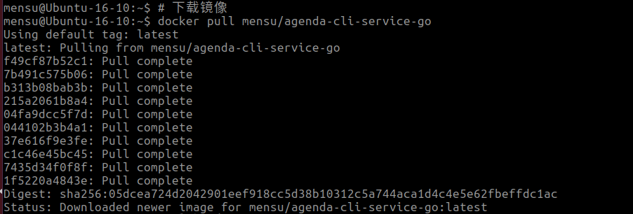
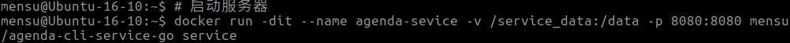
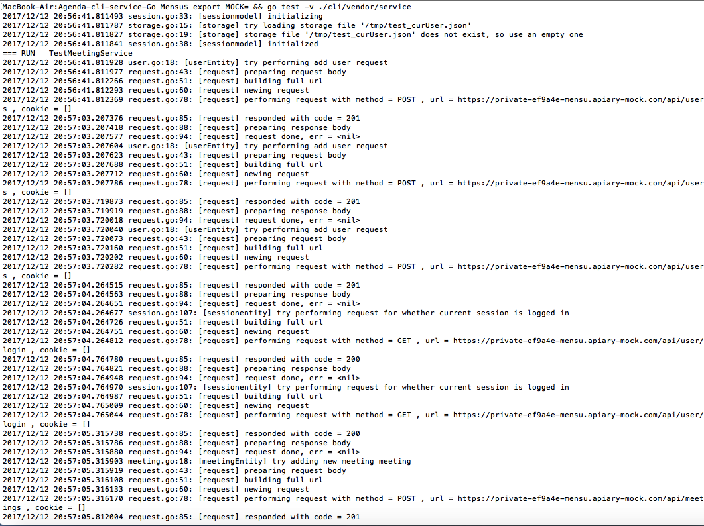
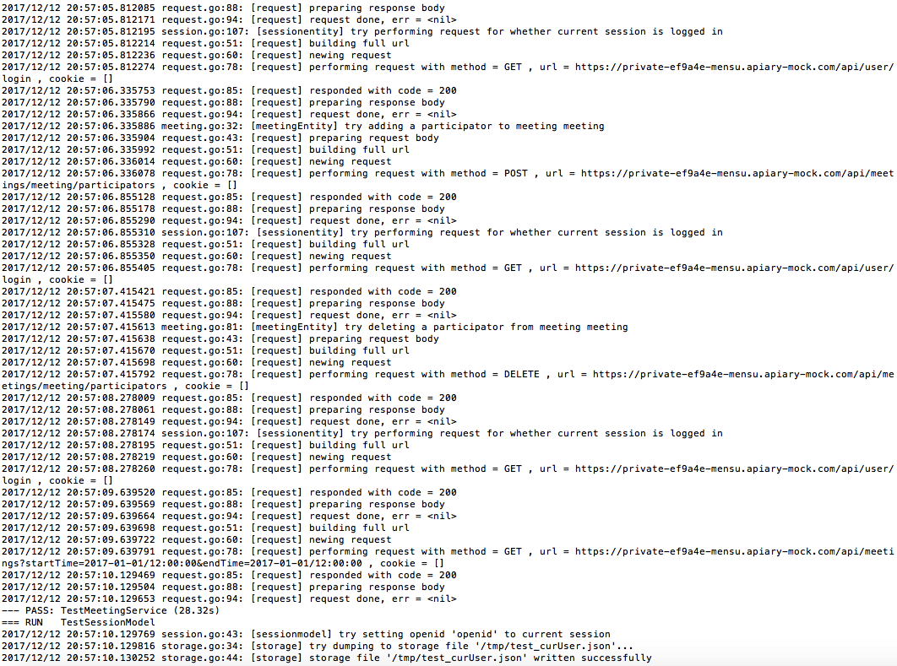
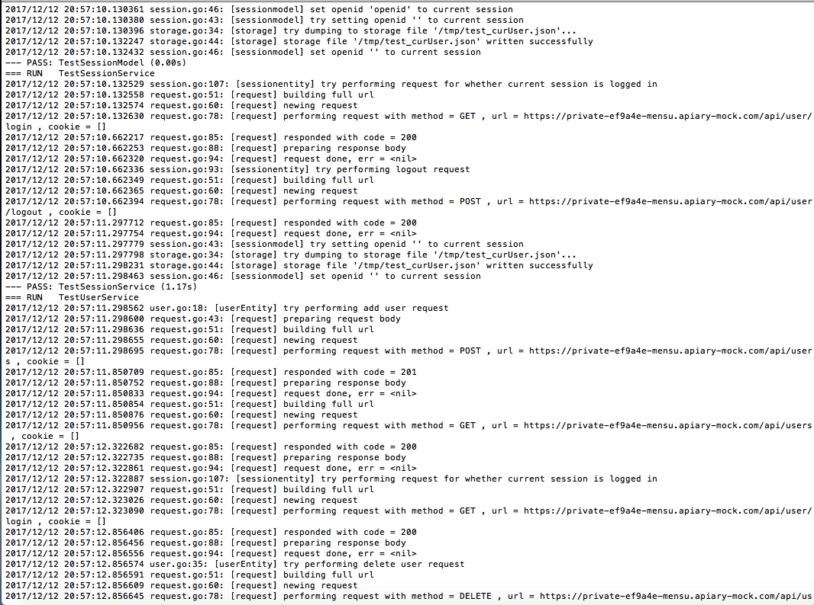
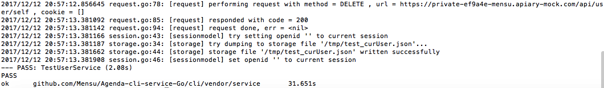
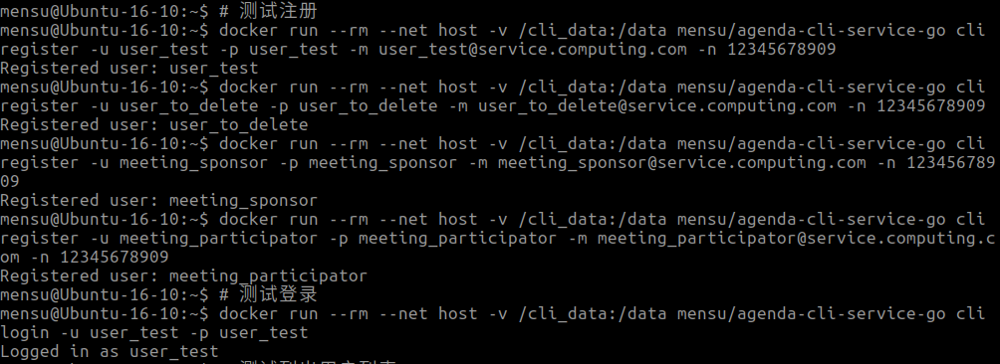
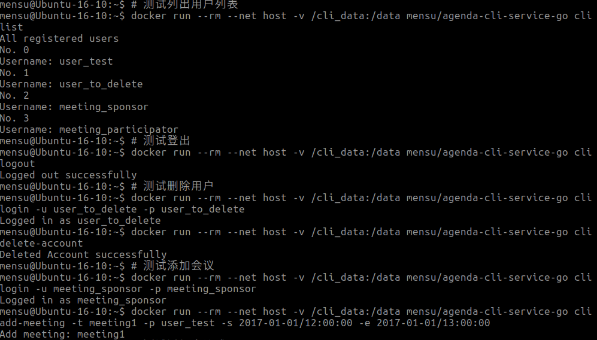
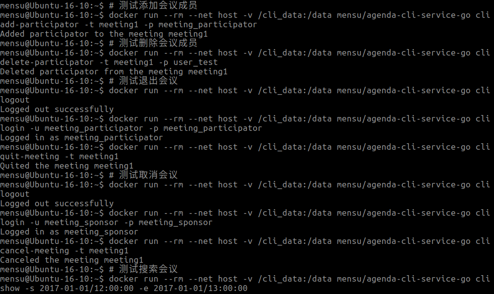

# Agenda Client & Service

> 课程《服务计算》作业七：用 Go 完成 Agenda 客户端和 RESTful API 服务端同步开发

[](https://travis-ci.org/Mensu/Agenda-cli-service-Go)

## 简单使用说明

```
# 下载镜像
docker pull mensu/agenda-cli-service-go
# 启动服务器
docker run -dit --name agenda-sevice -v $PATH_TO_SERVER_DATA:/data -p 8080:8080 mensu/agenda-cli-service-go service
# 运行客户端
docker run --rm --network host -v $PATH_TO_CLI_DATA:/data mensu/agenda-cli-service-go cli help
```

## 项目管理与团队协作

### TODO list

#### 任务目标

- [x] 熟悉 API 设计工具，实现从资源（领域）建模，到 API 设计的过程
- [x] 使用 Github ，通过 [API 文档](https://mensu.docs.apiary.io/#)，实现 agenda 命令行项目 与 RESTful 服务项目同步开发
- [x] 使用 API 设计工具提供 Mock 服务，两个团队独立测试 API
- [x] 使用 travis 测试相关模块
- [x] 利用 dockerfile 在 docker hub 上构建一个镜像，同时包含 agenda cli 和 agenda service， 如果 mysql 包含 服务器 和 客户端一样

#### 任务要求

##### 重构、或新建 agenda 项目，根目录必须包含
- [x] cli 目录
- [x] service 目录
- [x] .travis —— ``.travis.yml``
- [x] apiary.apib
- [x] dockerfile —— ``Dockerfile``
- [x] LICENSE
- [x] README.md
- [x] README-yourid.md 记录你的工作摘要（个人评分依据）—— ``README-Mensu.md、README-pfjhyyj.md``
##### API 开发
- [x] 使用 API Blueprint 设计 [API](https://mensu.docs.apiary.io/#)
- [x] 资源 URL 命名符合 RESTful 设计标准
- [x] 资源 CRUD 基本完整
##### API 客户端开发
- [x] 可用命令 5 个以上 —— ``共有多达 11 个可用命令``
- [x] 必须有 XXX-test.go 文件
##### 服务端开发
- [x] 使用 sqlite3 作为数据库 —— ``挂载于 /data 目录``
- [x] 建议使用课程提供的服务端框架
- [x] 必须有 XXX-test.go 文件
##### 容器镜像制作
- [x] 在 docker hub 上生成[镜像](https://hub.docker.com/r/mensu/agenda-cli-service-go/)
- [x] base 镜像 go-1.8
- [x] 需要加载 sqlite3
- [x] 同时包含客户端与服务器
##### README.md
- [x] 有 build pass 标签
- [x] 有简短使用说明
- [x] 有系统测试的结果（包含如何下载镜像，如何启动服务器，如何使用命令行，cli 的 mock 测试结果， 综合系统测试结果）
##### README-yourid.md
- [x] fork 项目的位置
- [x] 个人工作摘要（每次提交）
- [x] 项目小结

## 系统测试的结果

### 如何下载镜像

注：镜像构建测试已加入 [``Travis CI``](https://travis-ci.org/Mensu/Agenda-cli-service-Go)



### 如何启动服务器



### 如何使用命令行


### cli 的 mock 测试结果

注：mock 测试已加入 [``Travis CI``](https://travis-ci.org/Mensu/Agenda-cli-service-Go)






### 综合系统测试结果

注：综合系统测试已加入 [``Travis CI``](https://travis-ci.org/Mensu/Agenda-cli-service-Go)





### 持续集成

- 使用 [``Travis CI``](https://travis-ci.org/Mensu/Agenda-cli-service-go)，通过执行 go test 命令运行编写好的测试文件进行持续集成
- 从最开始的开发开始，**边开发边写对应的测试**，在一次次提交的过程中不断集成，减少新的改动破坏原有功能的可能性，为项目功能的稳定提供有力保障
- 测试内容包括
  + cli 的 mock 测试
  + service 的单元测试
  + docker 镜像构建测试
  + docker 镜像中客户端和服务端的综合测试

### 团队协作

- 团队成员从 master 的 ``master`` 分支 fork 出[新的仓库](https://github.com/pfjhyyj/Agenda-cli-service-go)负责 Agenda 客户端项目，与 master 的 RESTful 服务项目**同步开发**
- 团队成员开发完毕，向 master 的 ``master`` 分支发起 ``Pull Request``，并邀请 master ``review``
- master ``review`` 完觉得可以，且 ``CI`` 通过，方可确认归并代码
- master 作为 master 开发时，不得直接向 ``master`` 分支 push commit。而应该同样通过另开分支的方式进行需求开发。开发完毕后，向 master 的 ``master`` 分支发起 ``Pull Request``，并邀请团队成员 ``review``。同样，团队成员 ``review`` 完觉得可以，且 ``CI`` 通过，方可确认归并代码
- 以上限制通过设置 Github 完成，无需由团队成员假装限制

## 架构设计与实现细节

### 客户端

学习初级实训 Agenda 的设计思路，我们使用的是三层架构

#### 表示层 ``cmd``

- 负责接受用户输入，交给*业务逻辑层*提供的业务逻辑服务，得到结果并展示给用户
- 使用 ``fmt`` 包向屏幕打印信息

#### 业务逻辑层 ``service``

- 负责简单的表单验证，并调用*实体层*提供的接口发送请求，获得需要的数据

#### 实体层 ``entity``

- 负责和服务端的进行交互，维护交互所需的数据结构，返回上层需要的数据

### 服务端

使用课程提供的服务端框架，分为 service - dao - orm (entity) 三层

### 实体加载

- 实体使用 ``JSON`` 格式储存
- 数据的加载和储存由专门的 ``storage`` 结构完成，被负责数据操纵的 ``*Model`` 结构使用
- 各 ``*Model`` 应该只有一个实例，因此考虑使用**单例模式**。这里使用包全局变量的方式实现
- 各 ``*Model`` 的加载涉及 IO 操作，数据量大相对会比较耗时。又考虑到各 ``*Model`` 加载的独立性，于是我们通过 ``goroutine`` 实现并行加载

### log

- 每个层通过**工厂模式**产生并使用不同的 log 实例，方便统一设定 log 需要的属性，如输出的目的地、输出格式等。以后换 [``logrus``](https://github.com/Sirupsen/logrus) 包时也方便添加前缀
- 在表示层、业务逻辑层、实体层的关键地方记录用户的操作过程和输出

### 异常处理

- 对于因用户输入不当的逻辑错误，使用 ``go`` 语言标准的返回错误的模式，并提示用户
- 对于其他不可抗力产生的异常，如文件写入失败等，使用 ``Panic`` 函数生成函数栈并抛出，在每个 ``goroutine`` 最外面的恢复并记录至 ``log`` 中，为调试提供有力的线索

### 登录控制

- 使用 ``session`` 表示会话，控制登录状态。持久化于 ``curUser.json`` 文件中
- 会话的有效性由服务端控制。客户端将 ``openid`` 放到 ``cookie`` 里发到服务端来维持一段会话
